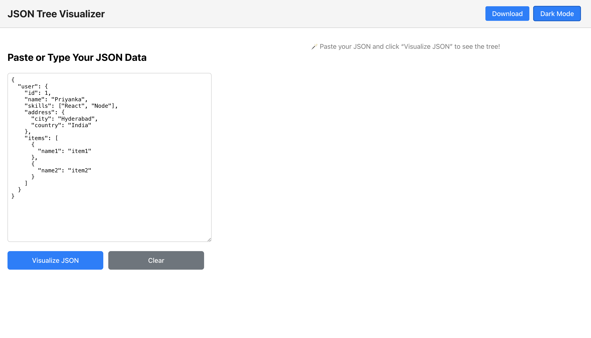
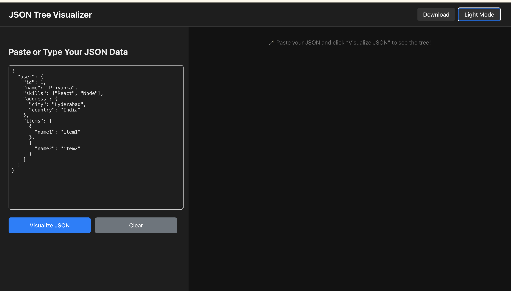
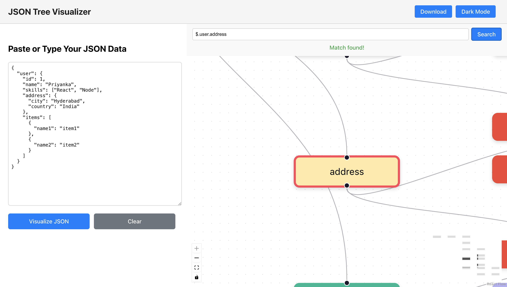
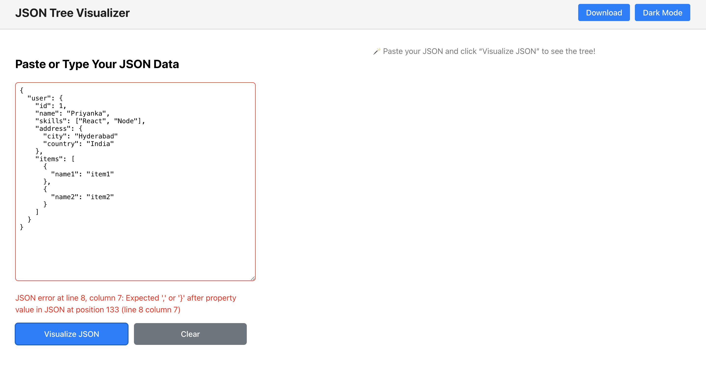

#  JSON Tree Visualizer

A simple and interactive web app to **visualize JSON data** as a connected tree using **React Flow**.  
It helps developers and data analysts quickly understand the structure of large JSON files.

---

## 🚀 Live Demo

🔗 **Deployed Link:** [https://jsontreevisualiser.netlify.app/](https://jsontreevisualiser.netlify.app/)


---

## 🖼️ Screenshots

### Light Mode
 

### Dark Mode
 |


### Search Highlight
 

### InValid Json 
 

---

## 🧠 About the Project

The **JSON Tree Visualizer** allows users to:
- Paste or type raw JSON and visualize it as a hierarchical node tree  
- Search any key or path — highlights and centers the matched node  
- Toggle between **Dark / Light themes**  
- Download the visualization as a **high-quality PNG**  
- Includes a **Root Node** for better structural clarity  

This project is built to make JSON debugging, exploration, and documentation more intuitive for developers.

---

## ⚙️ Tech Stack

| Category | Technology |
|-----------|-------------|
| **Frontend Framework** | React (with Vite) |
| **Visualization** | React Flow |
| **Image Export** | html-to-image (`v1.11.11`) |
| **Styling** |  CSS Modules  |
| **Deployment** | Netlify |

---

## 🛠️ Installation & Setup

### 1️⃣ Clone the Repository
```bash
git clone https://github.com/priyanka-777/JSON-Tree-Visualizer.git
cd <repo-name>
````

### 2️⃣ Install Dependencies

```bash
npm install
# or
yarn install
```

### 3️⃣ Important Dependency Versions

> To avoid edge rendering issues during image export, install the recommended version:

```bash
npm install html-to-image@1.11.11
```

### 4️⃣ Run Locally


```bash
npm run dev
```

Then open [http://localhost:5173](http://localhost:5173)


---


## 💡 Features Summary

* ✅ Real-time JSON structure visualization
* ✅ Smooth animations and zoom/pan controls
* ✅ Custom color themes (light/dark)
* ✅ Search and highlight functionality
* ✅ Download diagram as PNG (high resolution)
* ✅ Responsive and modern UI

---

## 🧑‍💻 Author

**Priyanka Inagadapu**
🔗 [GitHub](https://github.com/priyanka-777) • [LinkedIn](https://linkedin.com/in/inagadapu-priyanka)

---

⭐ If you like this project, consider giving it a star on GitHub! ⭐

